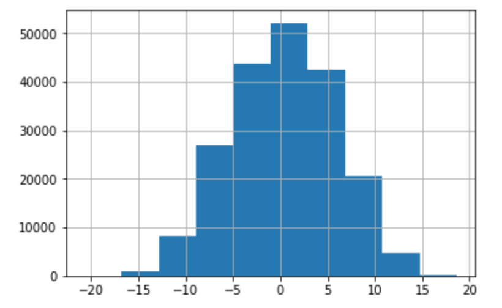
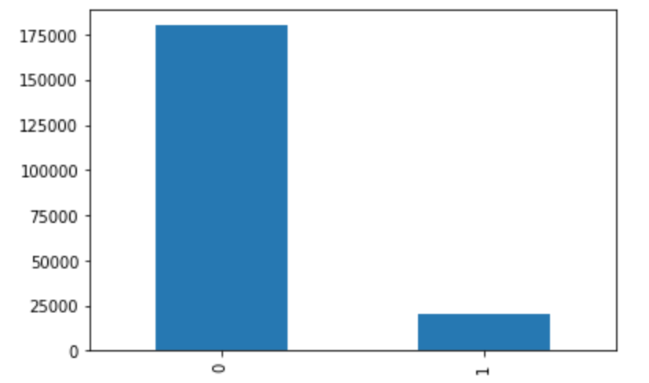
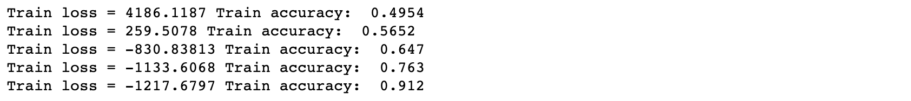
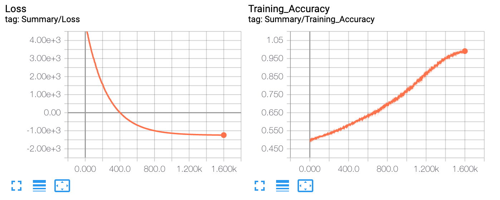
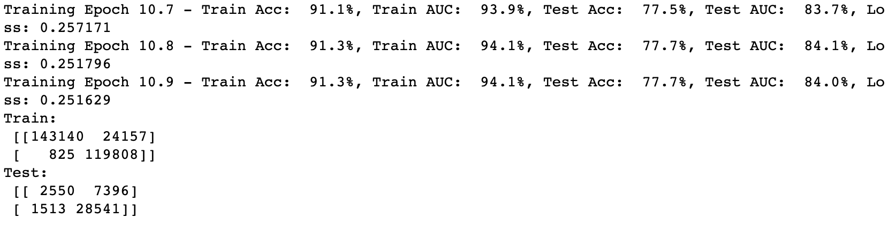
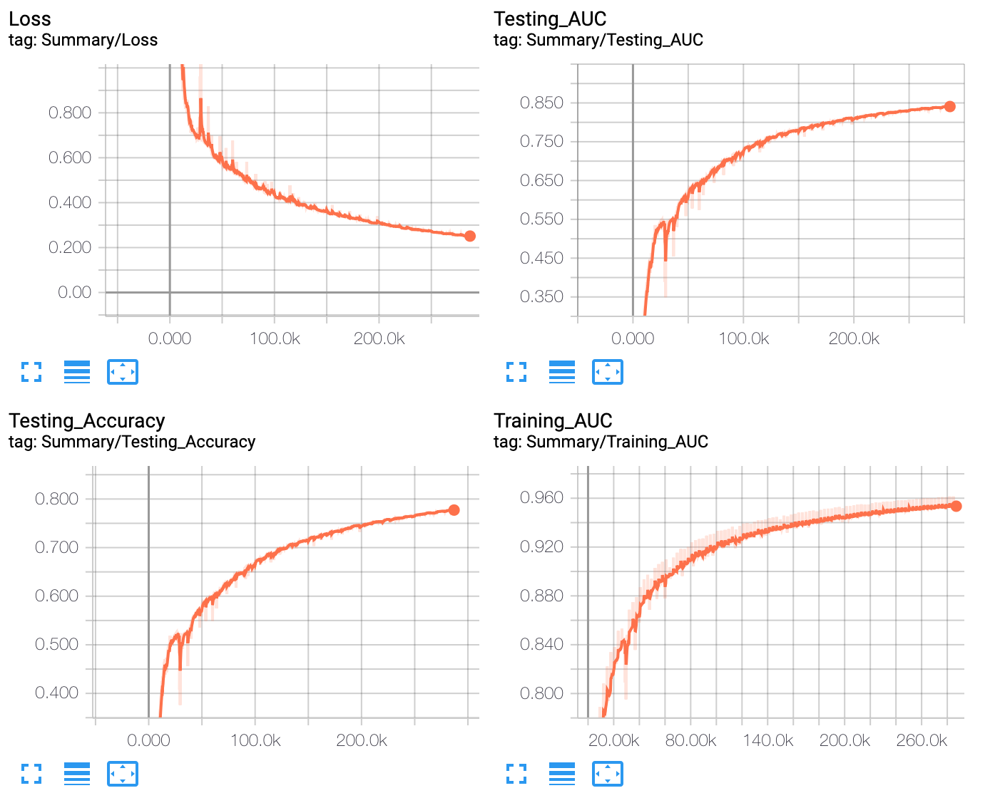
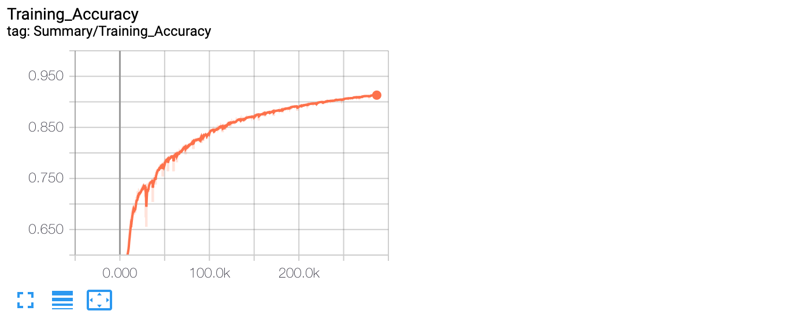

<h2 align="middle">CS433.7 Final Project - Transaction Prediction </h2>

### Contributor:

[Hang Zhu](https://github.com/leonzhuLGU)

[Changcheng Yuan](https://github.com/EricYJA)

Note that both contributors contributed to the project. The Github contribution is only showing submitting result. 

   

### Data Source:

https://www.kaggle.com/c/santander-customer-transaction-prediction/data

### Environment:

* OS:  Windows 10 / MacOS Mojave 10.14.3
* Python Version: 3.6

* TensorFlow Version: 1.12.0 
* TensorBoard Version: 1.12.1
* Numpy Version: 1.16.1
* Dependencies: pandas, sklearn, imblearn, matplotlib

---

### Objective:

The goal for this project is to predict if a customer would make the transaction or not based on its personal data. This is vital for a company's surval cause accurate prediction would make more profit by doing more efficient resource allocation. In addition, with this prediction, the company could know who is the core user of its service and who is not. By distinguishing the core user, the company would have a better chance to gain profit. 

### Data:

The data is loaded from 2 `.csv` file from the link in listed in the data source. The sample size is 200000. For each sample, there are 200 features. After testing, we have that the distribution for each of the feature is about normal distribution. For example, lable 0's distribution is shown below. 

  <table style="width=100%">
    <tr>
      <td>
        
        <figcaption align="middle">label_0</figcaption>
      </td>
      <td>
        
        <figcaption align="middle">0/1</figcaption>
      </td>
    </tr>
  </table>

For the negative/positive ratio however, the ratio is unballanced and the negative is the majority. As we can see from the picture above. 

---

### Model & Code:

For our project, you can run the jupyter notebook file sequentially to view all the result or to run the `Model 1 - SVM` and `Model 2 - A Simple Neural Network` part seperately to view the result for different model. Note that for either of the model, the package loading, the data loading, and the `data processing` part are required to run before running the models. 

Note that the tensorboard graphs are stored under `graph_SVM` and `graph_NN`. To view it, change the local directory to `graph_SVM` or `graph_NN`, and then run `tensorboard --logdir ./`. 

#### SVM:

Note that for this problem, the dataset are not seperatable using a linear SVM. Hence, We implemented the SVM using the gaussian kernel to implemented the nonlinear SVM. The basic idea is to use the gaussion kernel to plot the data in a higher dimension where its seperatable. For the training data, we have the training result below. 

The result shows that for training data, we could reach an accuracy over 90%. However, for testing data, the accuracy is really low. By chacking the data, the positive set and the negative set have massive intersecting area, and the dimension for each sample is too high for SVM. Therefore, the SVM would go overfitting after training. We conclude that the samples are not seperatable using linear method. Hence, we choose to use neural network for out final model. 

#### Neural Network:

Technics we use: simple random oversampling; batch normalization; leaky relu; Adam optimizer; exponential decay of the learning rate; batch gradient decent.

This is final model for our project. We used two hidden layers and adam optimizer for this neural network. The detailed structure is shown in the tensorboard graph. For this model, instead of using accuracy as the criteria, we choose to use the AUC as the criteria since the data is highly unbalanced. When training, we also balanced the data to gain a better prediction. Compare to SVM, this model would have better performance in real cases.

